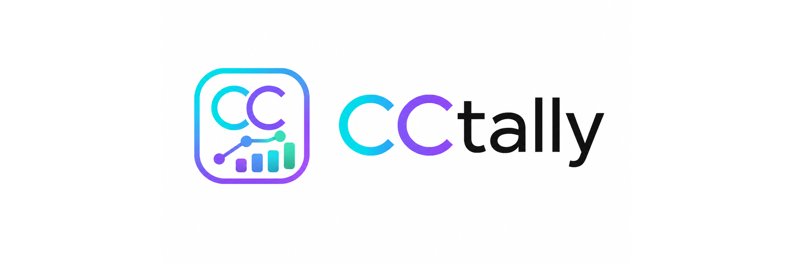
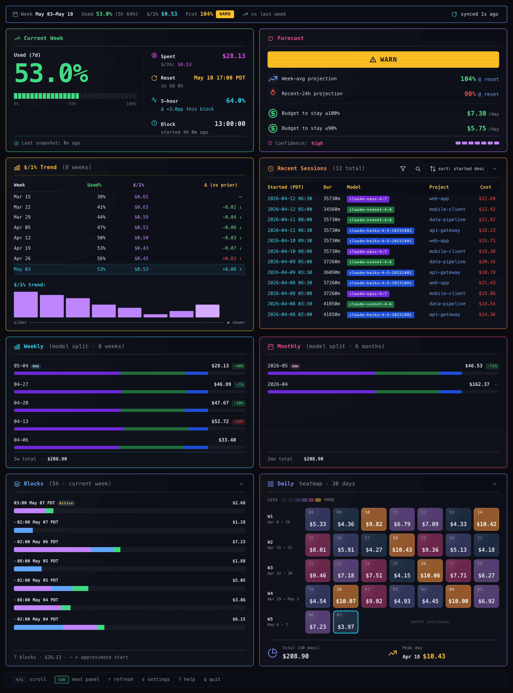
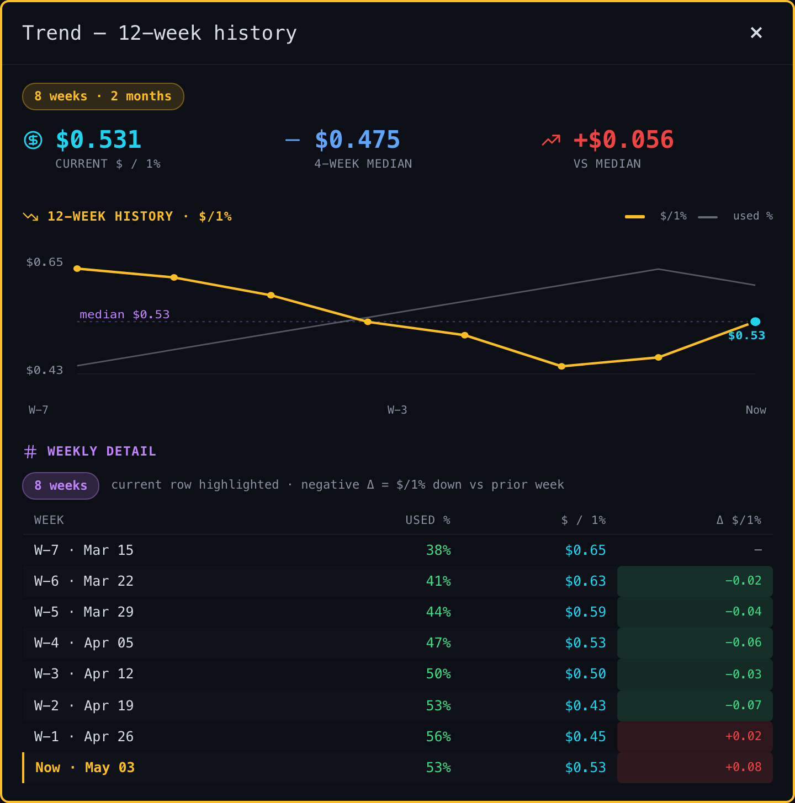
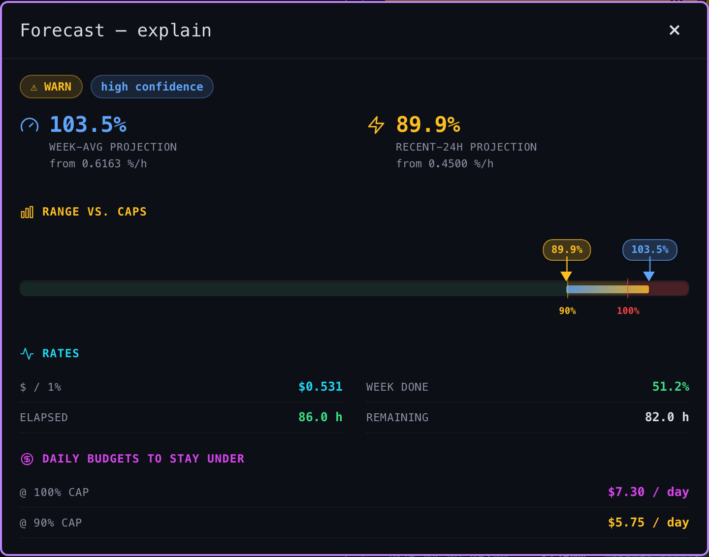
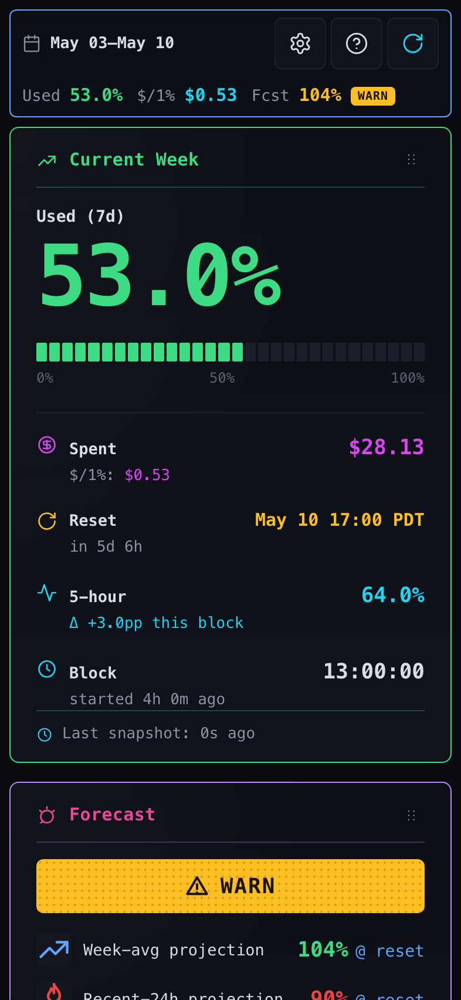
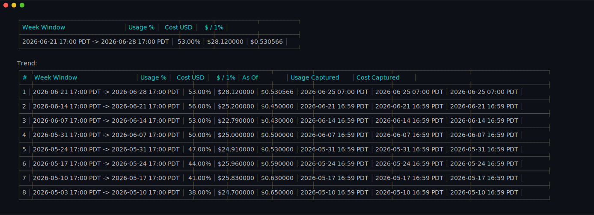
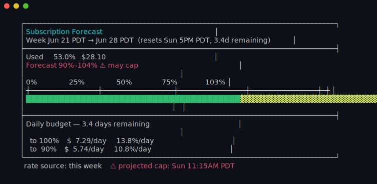
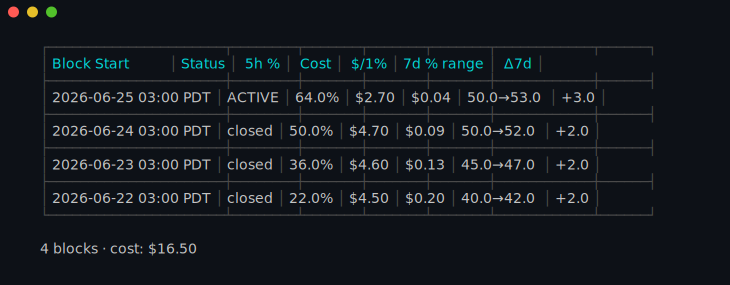
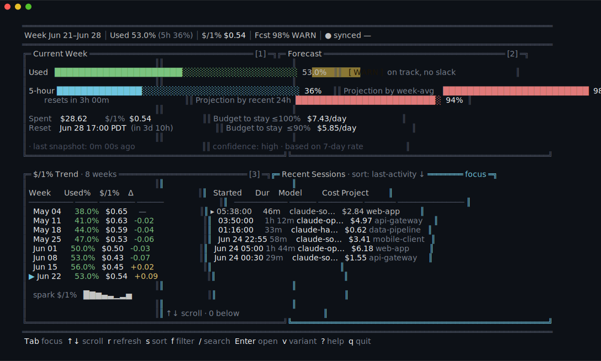

<p align="center">
  <picture>
    <source media="(prefers-color-scheme: dark)" srcset="docs/img/logo-dark.png">
    
  </picture>
</p>

<p align="center">
  <strong>Track Claude Code subscription usage as a weekly $-per-1% trend. Local web dashboard, terminal UI, forecasts, and threshold alerts.</strong>
</p>

If you're using `ccusage` to watch Claude Code spend, `cctally` covers the same ground and adds the parts you reach for next: a live web dashboard, a forecast that tells you whether you're going to cap this week, threshold alerts when you cross a percent, and a persistent week-over-week trend of cost per percent of quota. All local, no account, no telemetry.

<p align="center">
  
</p>

## Quick Start

**Requirements:** Python 3.13+, macOS or Linux, Claude Code installed and run at least once.

```bash
git clone https://github.com/omrikais/cctally
cd cctally
./bin/cctally setup
```

`cctally setup` symlinks the binaries into `~/.local/bin/`, adds three additive hooks to `~/.claude/settings.json` (never overwrites existing entries), and bootstraps the local SQLite cache. If `~/.local/bin/` isn't on your PATH, the script prints the line to add.

```bash
cctally setup --status     # verify hooks + symlinks
cctally daily              # cost-by-day, your first table
cctally dashboard          # opens http://127.0.0.1:8789
```

For status-line integration, alerts, and configuration, see [docs/installation.md](docs/installation.md) and [docs/configuration.md](docs/configuration.md).

## What it looks like

### Dashboard

<table>
  <tr>
    <td>
      
      <br><em>Any panel expands into a focused view. The trend modal shows twelve weeks of cost per percent.</em>
    </td>
    <td>
      
      <br><em>When the forecast projects a cap before the weekly reset, the modal goes amber.</em>
    </td>
  </tr>
  <tr>
    <td colspan="2" align="center">
      
      <br><em>The same dashboard on your phone.</em>
    </td>
  </tr>
</table>

### CLI tables

<p align="center">
  
  <br>
  <em>Weekly cost as dollars per percent of quota, with the delta against the prior week.</em>
</p>

<p align="center">
  
  <br>
  <em>Projected percent at the weekly reset, plus the daily budget to stay under the cap.</em>
</p>

<p align="center">
  
  <br>
  <em>Each 5-hour window, broken down by model.</em>
</p>

### Live terminal

<p align="center">
  
  <br>
  <em>The same data in the terminal, refreshed live.</em>
</p>

## What cctally adds

`cctally` started as a local-first replacement for [`ccusage`](https://github.com/ryoppippi/ccusage), and it stays compatible at the level of common CLI flows (`daily`, `monthly`, `weekly`, `session`, `blocks`). Beyond that, it adds:

- **Live web dashboard.** Nine-panel SSE-driven view at `localhost:8789` (current week, forecast, trend, sessions, weekly, monthly, blocks, daily, recent alerts), with per-panel modals, a mobile layout, threshold alerts, and a settings drawer.
- **TUI live mode.** The same data inside your terminal (`cctally tui`; requires the optional `rich` package).
- **$-per-1% weekly trend.** The `report` table reframes weekly cost as cost-per-percent-of-quota, so spending efficiency is visible week over week.
- **Forecast.** Projects current-week percent and daily $/% budgets against the 100% and 90% ceilings (`cctally forecast`).
- **Threshold alerts.** Configurable percent crossings with native macOS popups (`cctally alerts`).
- **5-hour block analytics.** Per-block usage with model and project breakdowns (`cctally five-hour-blocks --breakdown=model`).
- **Time-window diff.** Compare two windows with model and project decomposition (`cctally diff`).
- **Project rollup.** Usage by Git project (`cctally project`).
- **Codex parity.** Drop-in replacements for `ccusage-codex daily / monthly / session`, plus an added `cctally codex-weekly` rollup (upstream has no `codex weekly`).
- **Persistent SQLite.** Week-over-week comparisons survive across runs.

**On speed.** Pricing is embedded and computed at query time from a delta-tail SQLite cache (`~/.local/share/cctally/cache.db`), with no shell-outs. First-table latency on 30 days of session data: **~2.6s (cctally) vs ~31s (ccusage)**, about 12× faster. Measured by `bench/cctally-vs-ccusage.sh` on macOS arm64, 2026-05-05; your numbers will vary.[^bench]

<!--
  Footnote target uses an absolute URL because GitHub's relative-link
  rewriter doesn't traverse into GFM footnote `<li>` content; on the
  repo home page (`/omrikais/cctally`, no trailing slash) the browser
  would resolve `bench/README.md` against the page URL and produce
  `/omrikais/bench/README.md` — a broken path. Regular paragraph links
  are unaffected.
-->
[^bench]: Methodology and reproduction: [`bench/README.md`](https://github.com/omrikais/cctally/blob/main/bench/README.md).

## Documentation

- [Installation](docs/installation.md): symlinks, status-line wiring, Python version.
- [Configuration](docs/configuration.md): `config.json` shape and week-start rules.
- [Architecture](docs/architecture.md): data flow, caches, week boundaries.
- [Runtime data](docs/runtime-data.md): what lives in `~/.local/share/cctally/`.
- [Command reference](docs/commands/): one page per subcommand.

## Version

Current release: `v1.0.0`.

## License

Apache 2.0. See [`LICENSE`](LICENSE).
