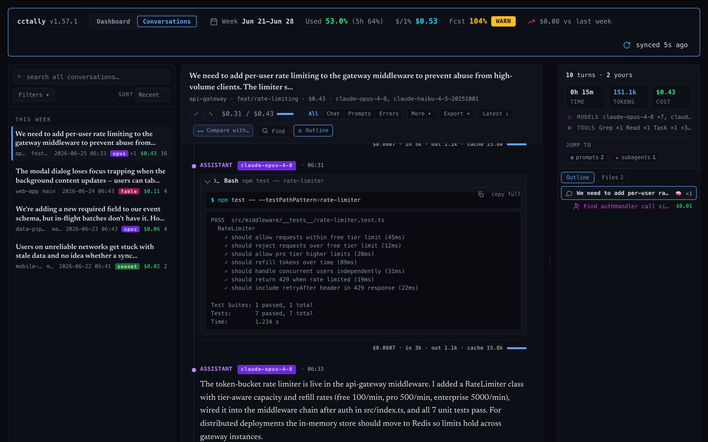
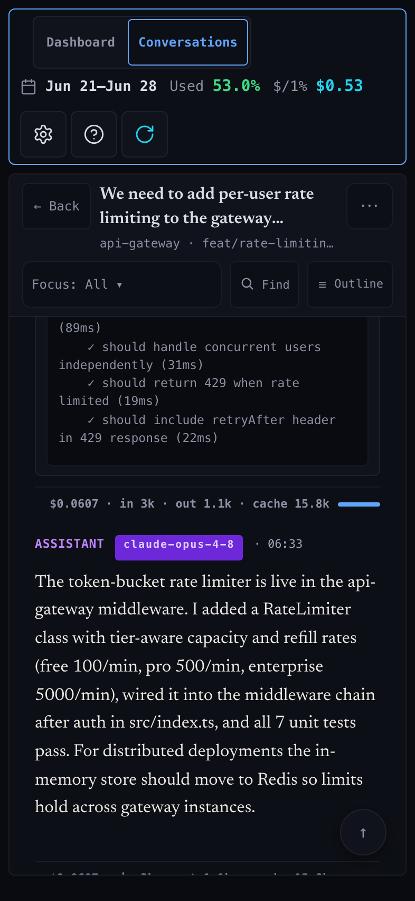

<p align="center">
  <picture>
    <source media="(prefers-color-scheme: dark)" srcset="docs/img/logo-dark.png">
    
  </picture>
</p>

<p align="center">
  <strong>Local-first usage tracker for Claude Code on Pro/Max - live dashboard, conversation viewer, weekly cost-per-percent trend, quota forecast, and threshold alerts. ccusage-compatible.</strong>
</p>

<p align="center">
  <a href="https://www.npmjs.com/package/cctally"></a>
  <a href="https://www.npmjs.com/package/cctally"></a>
  <a href="https://github.com/omrikais/cctally/blob/main/LICENSE"></a>
  <a href="https://github.com/omrikais/cctally/stargazers"></a>
</p>

Claude Code's Pro/Max plans meter you on a weekly quota, but the only signal you get is a percentage that creeps up until you cap. `cctally` turns that percentage into something you can act on: it reads your local session logs, computes cost in-process, and shows you **how much each percent of quota is actually costing you, whether you're on track to cap this week, and exactly where the spend is going** - across a live web dashboard, a read-only conversation viewer, and a full set of CLI reports. Everything runs locally against your own `~/.claude` data. No account, no API key, no cloud processing — cctally never uploads your session data, and its only telemetry is an anonymous, opt-out [install count](#privacy--telemetry).

<p align="center">
  
</p>

## Quick start

**Requirements:** Python 3.11+, macOS or Linux, Claude Code installed and run at least once.

```bash
# Homebrew (macOS / Linux)
brew install omrikais/cctally/cctally && cctally setup

# …or npm
npm install -g cctally && cctally setup

# …or from source
git clone https://github.com/omrikais/cctally && cd cctally && ./bin/cctally setup
```

The reporting commands work right away — you don't need `cctally setup` first. Straight after an install, `npx cctally daily` (or, once it's global, `cctally daily`) reads your existing `~/.claude` session logs directly and prints a cost table; `cctally dashboard` and `cctally tui` work the same way. `cctally setup` is what adds *auto-recording* — the live status-line quota percentage and the hooks that keep data flowing as you work — so run it once you want continuous tracking rather than on-demand reports.

`cctally setup` symlinks the binaries into `~/.local/bin/`, adds three additive hooks to `~/.claude/settings.json` (it never overwrites existing entries), and bootstraps the local SQLite cache — on a large session history that first-run sync now shows live progress instead of sitting silent. If `~/.local/bin/` isn't on your `PATH`, the script prints the line to add. The npm install needs Python 3 on `PATH` - if setup reports "python3 not found", install it (`brew install python` on macOS) and re-run.

```bash
cctally setup --status     # verify hooks + symlinks
cctally daily              # cost-by-day - your first table
cctally dashboard          # opens http://127.0.0.1:8789
```

For status-line integration and tuning, see [docs/installation.md](docs/installation.md) and [docs/configuration.md](docs/configuration.md).

**Beta channel (opt-in).** Every release ships to a beta channel first; the maintainer promotes the ones that prove out to stable, which is the default. To ride along with the newest builds as they land, opt in with `cctally config set update.channel beta` (npm or source installs — Homebrew tracks stable). `cctally update` then installs the exact latest beta version, and `cctally config set update.channel stable` flips you back cleanly with no silent downgrade. See [docs/commands/update.md](docs/commands/update.md#beta-channel).

## The live dashboard

`cctally dashboard` serves a web app at `localhost:8789` that updates live as you work - no refresh, no polling. Eleven panels cover the whole picture: **current week**, **forecast**, **$/1% trend**, **recent sessions**, **weekly**, **monthly**, **5-hour blocks**, **daily heatmap**, **projects**, **cache report**, and **recent alerts**. Any panel expands into a focused view, sessions are filterable and searchable, and a settings drawer tunes alerts and display options on the fly. It runs only on your own machine by default; one flag opens it to the other devices on your network when you want that.

<table>
  <tr>
    <td>
      
      <br><em>Any panel expands into a focused view - here, twelve weeks of cost per percent.</em>
    </td>
    <td>
      
      <br><em>When the forecast projects a cap before the weekly reset, the modal goes amber.</em>
    </td>
  </tr>
  <tr>
    <td colspan="2" align="center">
      
      <br><em>The same dashboard, reflowed for your phone.</em>
    </td>
  </tr>
</table>

See [docs/commands/dashboard.md](docs/commands/dashboard.md).

## Conversation viewer ⭐

The dashboard's **Conversations** tab is a read-only reader for your Claude Code transcripts - your local session history, rendered the way you'd actually want to review it. A searchable rail lists every conversation with its project, branch, model chips, and cost; the reader shows the full turn-by-turn flow with thinking blocks, tool calls (with diffs and command output), and a per-turn cost-and-token breakdown. Parallel **subagent threads** render as their own nested threads, an outline pane jumps you to any turn, and an in-conversation find bar plus a faceted full-text search (prompts, assistant text, tools, thinking) make a month of sessions navigable. The open conversation **live-tails** as you work, updating within a second.

It only reads your transcripts - it never changes them - and everything stays on your own machine. Nothing is uploaded, and the viewer is reachable only from your computer unless you choose to share the dashboard with your network.

<p align="center">
  
  <br>
  <em>Rail, threaded reader with tool cards and a subagent thread, and the jump-to outline.</em>
</p>

<p align="center">
  
  <br>
  <em>The same reader on your phone.</em>
</p>

## Cost per 1% of quota

The signature view. `cctally report` reframes each subscription week's spend as **dollars per percent of quota used**, so you can see your spending efficiency trend week over week - and whether this week is pulling above or below the line - instead of staring at a raw percentage. Persisted to SQLite, so the comparison survives across runs.

<p align="center">
  
  <br>
  <em>Weekly cost as dollars per percent of quota, with the delta against the prior week.</em>
</p>

See [docs/commands/report.md](docs/commands/report.md).

## Forecast & budget

`cctally forecast` projects where your weekly percentage lands at the next reset - using both a week-average and a recent-24h rate - and tells you the daily $/% budget you'd need to stay under the 100% and 90% ceilings. When the data is thin it says so (`LOW CONF`) rather than guessing.

<p align="center">
  
  <br>
  <em>Projected percent at the weekly reset, plus the daily budget to stay under the cap.</em>
</p>

For dollar budgets, `cctally budget` tracks an equivalent-vs-actual spend target over a configurable calendar period - per vendor, for both Claude and Codex - with a pace projection and an `ok`/`warn`/`over` verdict. See [docs/commands/forecast.md](docs/commands/forecast.md) and [docs/commands/budget.md](docs/commands/budget.md).

## Threshold alerts

Get a native desktop notification the moment you cross a percent milestone, so a runaway week can't sneak up on you. Alerts fire on weekly percent, 5-hour blocks, and budget thresholds, with three severity levels (info / warn / critical) and native popups on macOS and Linux - or run a command of your own. `cctally alerts test` confirms it's wired up. See [docs/commands/alerts.md](docs/commands/alerts.md).

## 5-hour analytics

Claude Code's quota also runs on rolling 5-hour windows. `cctally blocks` and `cctally five-hour-blocks` break usage down per window - anchored to the real API resets where a recorded reset covers the window (`blocks` marks its heuristic fallback rows with `~`), not a re-sizable guess - with model and project rollups and cross-reset flags, and `cctally five-hour-breakdown` drills into the per-percent milestones inside a single block.

<p align="center">
  
  <br>
  <em>Each 5-hour window, with rollup totals and 7-day drift.</em>
</p>

See [docs/commands/blocks.md](docs/commands/blocks.md) and [docs/commands/five-hour-blocks.md](docs/commands/five-hour-blocks.md).

## Live terminal UI

Prefer to stay in the terminal, or working over SSH? `cctally tui` shows the same live data as a refreshing terminal dashboard. It's the one feature that needs the optional `rich` library; every other command runs on a plain Python install with nothing else to set up.

<p align="center">
  
  <br>
  <em>The same data in the terminal, refreshed live.</em>
</p>

See [docs/commands/tui.md](docs/commands/tui.md).

## Shareable reports

All eight reporting commands (`report`, `daily`, `monthly`, `weekly`, `forecast`, `project`, `five-hour-blocks`, `session`) can render to shareable Markdown, HTML, or SVG with `--format`, a light/dark `--theme`, and `--output` / `--copy` / `--open`. Project names anonymize by default (`--reveal-projects` opts in), so you can post a snapshot without leaking where you work. See [docs/commands/share.md](docs/commands/share.md).

## Codex parity

If you also use OpenAI's Codex CLI, `cctally codex daily / monthly / session` are drop-ins for `ccusage codex daily / monthly / session`, reading from `~/.codex/sessions/`. The flat `codex-*` forms (drop-ins for the standalone `ccusage-codex` binary) stay as aliases, and `cctally codex weekly` adds a subscription-week rollup that upstream doesn't have. See [docs/commands/codex.md](docs/commands/codex.md).

## Diagnostics & upkeep

`cctally doctor` gives you a read-only health check - install, hooks, sign-in, database, data freshness, pricing, and safety - and the same status shows up in the dashboard. `cctally pricing-check` warns you when the built-in model pricing is getting stale, `cctally db` manages the local database, and `cctally update` keeps your install current. The local cache is always safe to delete or rebuild.

## Privacy & telemetry

cctally sends an anonymous, opt-out **install-count beat** — at most once a day — so the project can gauge how many people actually use it (npm and GitHub numbers are drowned in bots and mirrors). The entire payload is a one-way token that rotates every month (derived from a random local id that never leaves your machine and can't be recovered from the token), the cctally version, and a coarse OS family (`macos`/`linux`/`windows`/`other`). No identity, file paths, prompts, usage data, or stored IP — ever. The first beat is held for at least 24 hours after first run, so you always have a window to opt out first.

Turn it off any time with `cctally telemetry off` (or `cctally config set telemetry.enabled false`, `CCTALLY_DISABLE_TELEMETRY=1`, or the community-standard `DO_NOT_TRACK=1`); it's also off automatically in dev checkouts. Run `cctally telemetry` to see the current state and exactly what would be sent. The full transparency page — token construction, retention, and an honest threat model — is [docs/telemetry.md](docs/telemetry.md).

## A faster, local-first ccusage

`cctally` started as a local replacement for [`ccusage`](https://github.com/ryoppippi/ccusage) and stays compatible at the level of common flows: `cctally claude <cmd>` is a drop-in for `ccusage claude <cmd>` (and `cctally codex <cmd>` for `ccusage codex <cmd>`), with the flat forms (`cctally daily`, `cctally codex-daily`, …) kept as aliases. Paste your ccusage commands verbatim - then reach for the dashboard, forecast, trend, conversation viewer, and alerts that ccusage doesn't have.

It's also fast. Pricing is built in and computed in-process from a local SQLite cache, with no external tools to spawn. First table on 30 days of session data: **~2.6s (cctally) vs ~31s (ccusage)**, about 12× faster. Measured by `bench/cctally-vs-ccusage.sh` on macOS arm64, 2026-05-05; your numbers will vary.[^bench]

<!--
  Footnote target uses an absolute URL because GitHub's relative-link
  rewriter doesn't traverse into GFM footnote `<li>` content; on the
  repo home page (`/omrikais/cctally`, no trailing slash) the browser
  would resolve `bench/README.md` against the page URL and produce
  `/omrikais/bench/README.md` - a broken path. Regular paragraph links
  are unaffected.
-->
[^bench]: Methodology and reproduction: [`bench/README.md`](https://github.com/omrikais/cctally/blob/main/bench/README.md).

## Documentation

- [Installation](docs/installation.md): symlinks, status-line wiring, Python version.
- [Configuration](docs/configuration.md): `config.json` shape and week-start rules.
- [Architecture](docs/architecture.md): data flow, caches, week boundaries.
- [Runtime data](docs/runtime-data.md): what lives in `~/.local/share/cctally/`.
- [Telemetry](docs/telemetry.md): the anonymous install-count beat, in full — and how to opt out.
- [Command reference](docs/commands/): one page per subcommand.

## License

Apache 2.0. See [`LICENSE`](LICENSE).
