<p align="center">
  <picture>
    <source media="(prefers-color-scheme: dark)" srcset="docs/img/logo-dark.png">
    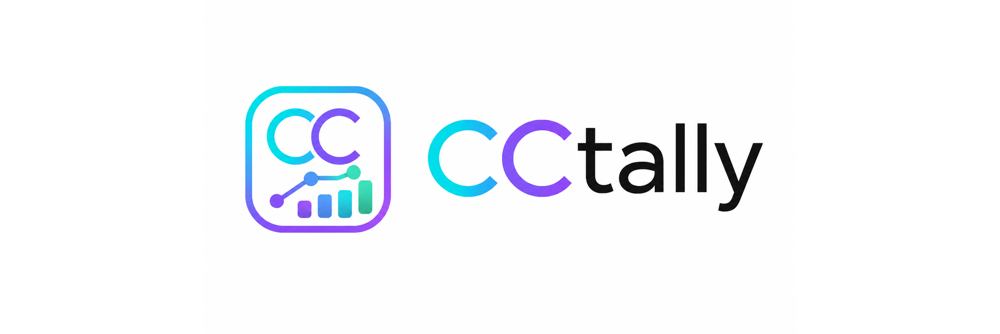
  </picture>
</p>

<p align="center">
  <strong>Understand Claude Code and Codex spend: a local dashboard, conversation viewer, and CLI reports for your subscription quota.</strong>
</p>

<p align="center">
  <a href="https://www.npmjs.com/package/cctally"></a>
  <a href="https://www.npmjs.com/package/cctally"></a>
  <a href="https://github.com/omrikais/cctally/blob/main/LICENSE"></a>
  <a href="https://github.com/omrikais/cctally/stargazers"></a>
</p>

Your Claude Code plan meters you with a percentage that creeps up all week. cctally reads your local session logs and turns that percentage into dollars: what each percent of quota costs you, whether you are on track to cap before the reset, and where the spend is going. It does the same for OpenAI's Codex CLI. Everything runs on your own machine, against your own data. No account, no API key, and nothing is uploaded.

> **Claude cost coverage:** Claude dollar and token totals are
> [transcript-derived lower bounds](docs/claude-cost-coverage.md), not exact
> `/usage` billing totals. Claude Code can bill title-generation and
> prompt-suggestion/side-query requests without retaining usable model/token
> fields. cctally does not guess the missing amount. Codex accounting uses a
> different retained source and is unaffected.

<p align="center">
  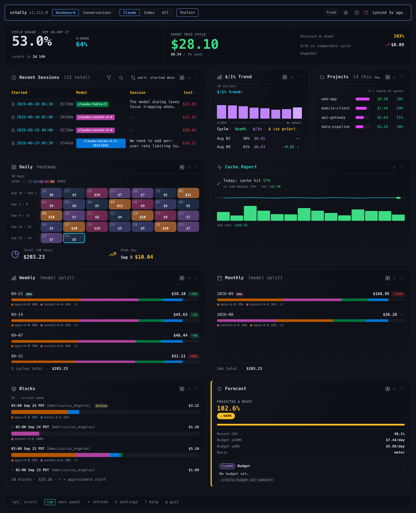
</p>

<!-- cctally:latest-stable:begin -->
**Latest stable: v1.87.1** (2026-07-30)

- Codex session names now remain visible in Recent Sessions when an individual account is selected, whenever transcript visibility is enabled. Selecting an account no longer replaces every session name with an em dash; disabling transcript visibility still hides names in both the all-accounts and focused-account views.
<!-- cctally:latest-stable:end -->

## Quick start

Requirements: Python 3.11+, macOS or Linux, Claude Code installed and run at least once.

```bash
# Homebrew (macOS / Linux)
brew install omrikais/cctally/cctally && cctally setup

# or npm
npm install -g cctally && cctally setup

# or from source
git clone https://github.com/omrikais/cctally && cd cctally && ./bin/cctally setup
```

The reporting commands work immediately on your existing logs, before any setup. Running `cctally setup` once adds the hooks that record your quota percentage continuously as you work.

```bash
cctally daily              # cost by day: your first table
cctally dashboard          # opens http://127.0.0.1:8789
cctally setup --status     # verify the install
```

Install details (symlinks, PATH, Python version) live in [docs/installation.md](docs/installation.md). Every release ships to an opt-in beta channel first; see [docs/commands/update.md](docs/commands/update.md#beta-channel).

## The live dashboard

`cctally dashboard` serves a local web app that updates live as you work, with no refresh and no polling. Panels cover the current week, the forecast, the cost trend, sessions, 5-hour blocks, projects, and alerts. Any panel expands into a focused view, sessions are searchable, and every report can be exported as shareable Markdown, HTML, or SVG with project names anonymized by default. It stays on your machine unless you choose to open it to your network.

<table>
  <tr>
    <td>
      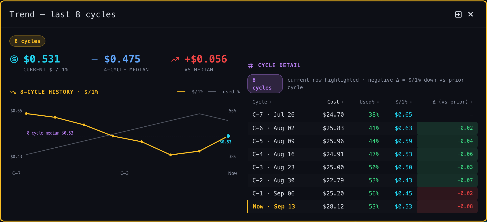
      <br><em>Any panel expands into a focused view: here, twelve weeks of cost per percent.</em>
    </td>
    <td>
      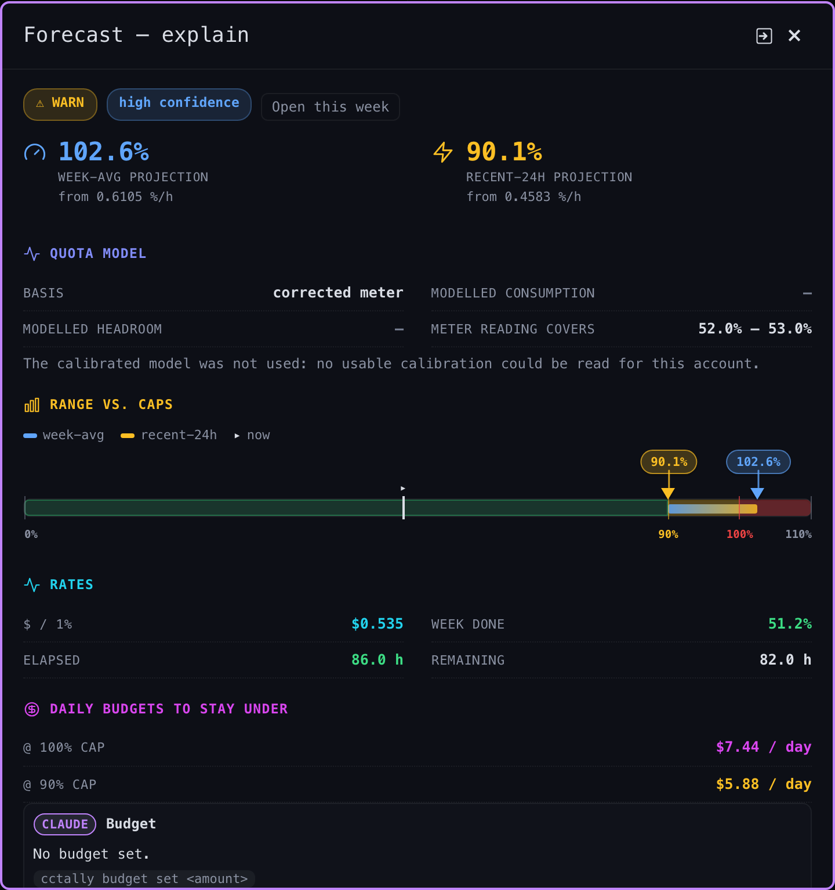
      <br><em>When the forecast projects a cap before the weekly reset, the modal turns amber.</em>
    </td>
  </tr>
  <tr>
    <td colspan="2" align="center">
      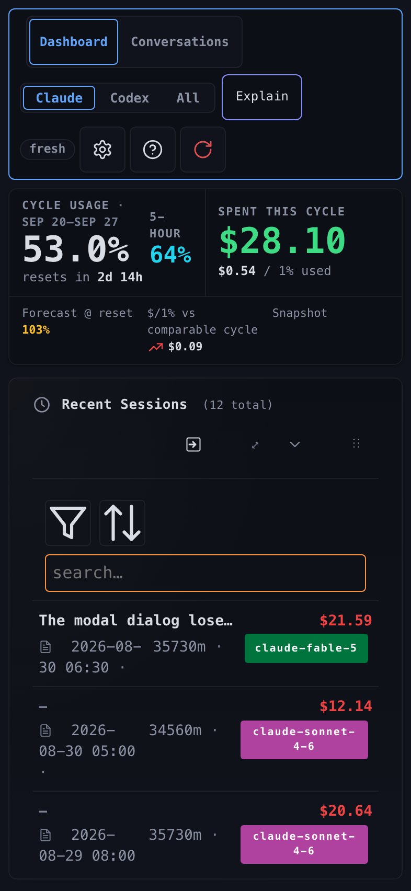
      <br><em>The same dashboard, reflowed for your phone.</em>
    </td>
  </tr>
</table>

See [docs/commands/dashboard.md](docs/commands/dashboard.md).

## Conversation viewer

The dashboard's Conversations tab is a read-only reader for your Claude Code transcripts. A searchable rail lists every conversation with its project, branch, models, and cost; the reader shows the full turn-by-turn flow with thinking blocks, tool calls, and per-turn cost. Subagent runs render as nested threads, and the open conversation live-tails as you work. It never modifies your transcripts, and it never leaves your machine.

<p align="center">
  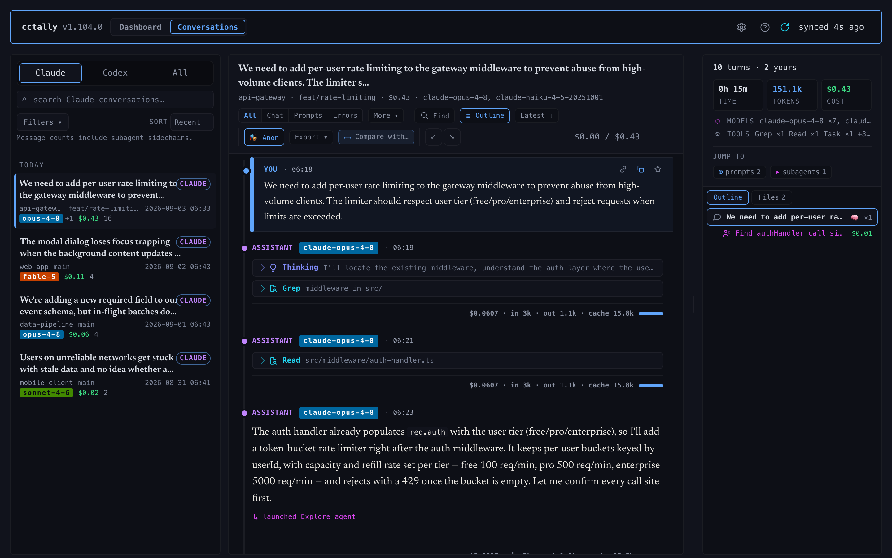
</p>

<p align="center">
  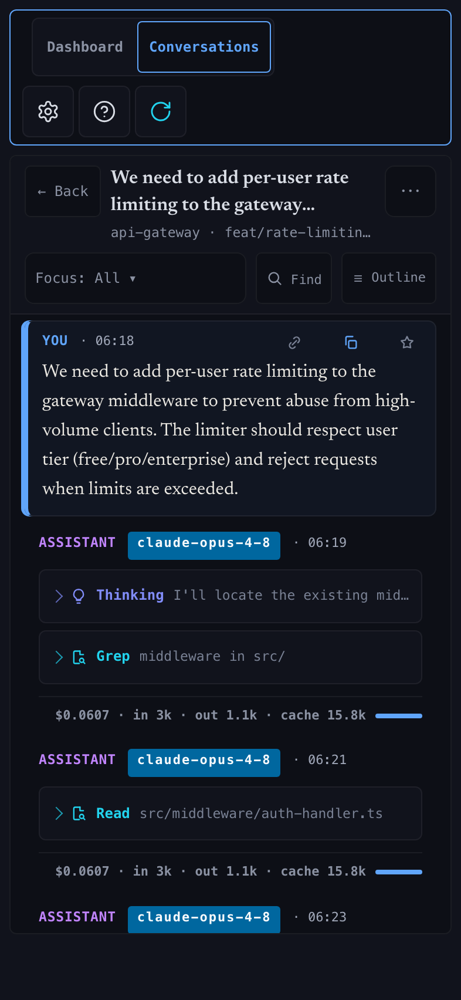
  <br>
  <em>The same reader on your phone.</em>
</p>

## Cost per 1% of quota

The signature view. `cctally report` reframes each week's spend as dollars per percent of quota used, so you can watch your spending efficiency trend week over week instead of staring at a raw percentage.

<p align="center">
  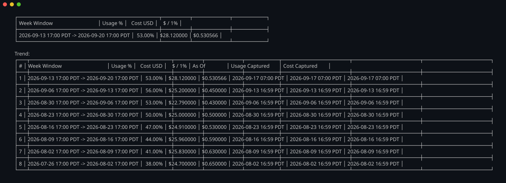
</p>

See [docs/commands/report.md](docs/commands/report.md).

## Forecast, budget, and alerts

`cctally forecast` projects where your weekly percentage lands at the next reset and tells you the daily budget that keeps you under the cap. `cctally budget` tracks a dollar target per provider over a calendar period. Native desktop notifications fire the moment you cross a percent, 5-hour, or budget threshold, so a runaway week cannot sneak up on you.

<p align="center">
  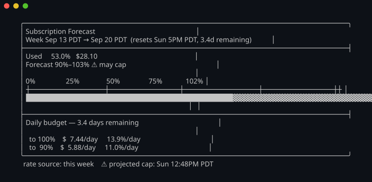
</p>

See [docs/commands/forecast.md](docs/commands/forecast.md), [docs/commands/budget.md](docs/commands/budget.md), and [docs/commands/alerts.md](docs/commands/alerts.md).

## 5-hour blocks

Claude Code's quota also runs on rolling 5-hour windows. `cctally blocks` and `cctally five-hour-blocks` break usage down per window, anchored to the real API resets, with model and project rollups.

<p align="center">
  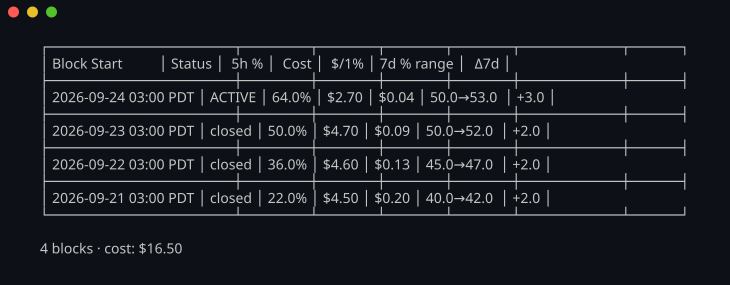
</p>

See [docs/commands/blocks.md](docs/commands/blocks.md) and [docs/commands/five-hour-blocks.md](docs/commands/five-hour-blocks.md).

## Codex

If you also use OpenAI's Codex CLI, cctally tracks it with the same depth. `cctally codex daily`, `monthly`, and `session` are drop-in replacements for the ccusage codex commands, reading from your local `~/.codex/sessions/`. `cctally codex weekly` adds a subscription week rollup, and `cctally codex quota` shows your native Codex rate limit windows.

<p align="center">
  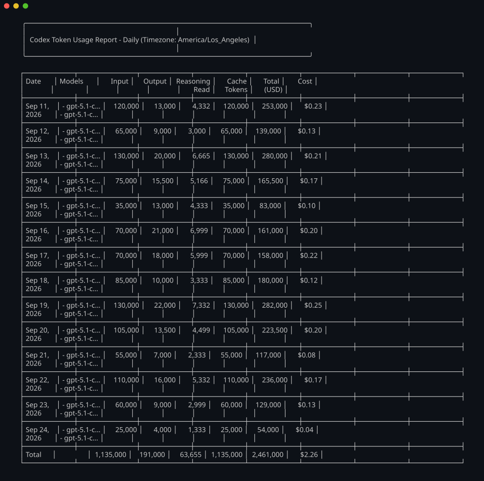
</p>

See [docs/commands/codex.md](docs/commands/codex.md) and [docs/commands/codex-quota.md](docs/commands/codex-quota.md).

## Terminal UI

Prefer to stay in the terminal, or working over SSH? `cctally tui` shows the same live data as a refreshing terminal dashboard. It is the one feature that needs the optional `rich` library; everything else runs on a plain Python install.

<p align="center">
  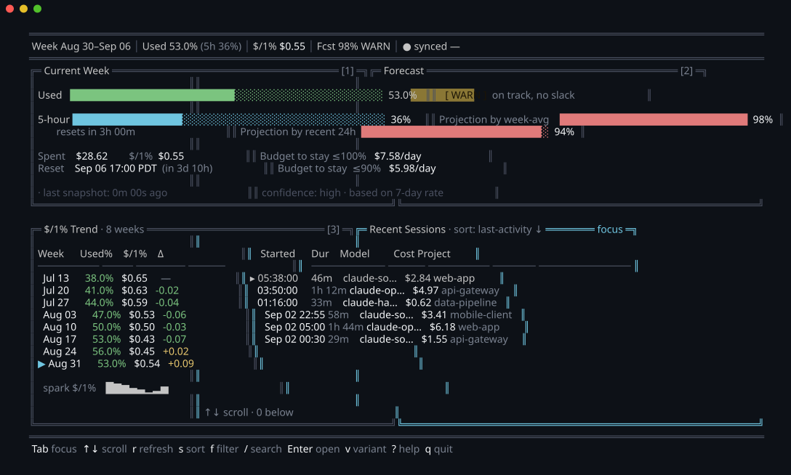
</p>

See [docs/commands/tui.md](docs/commands/tui.md).

## ccusage compatibility

cctally started as a local replacement for [ccusage](https://github.com/ryoppippi/ccusage) and stays drop-in compatible: `cctally claude <cmd>` and `cctally codex <cmd>` accept your ccusage commands verbatim. It is also fast: first table on 30 days of session data took about 2.6 seconds against about 31 seconds for ccusage (about 12x, measured 2026-05-05; methodology in [bench/README.md](https://github.com/omrikais/cctally/blob/main/bench/README.md)).

## Privacy

Everything runs locally against your own `~/.claude` and `~/.codex` data; session content is never uploaded. The only telemetry is an anonymous, opt-out install-count beat (a rotating one-way token, the version, and a coarse OS family, at most once a day). Turn it off any time with `cctally telemetry off`. The full transparency page is [docs/telemetry.md](docs/telemetry.md).

## Documentation

- [Installation](docs/installation.md): symlinks, status-line wiring, Python version.
- [Configuration](docs/configuration.md): config.json shape and week-start rules.
- [Architecture](docs/architecture.md): data flow, caches, week boundaries.
- [Telemetry](docs/telemetry.md): the anonymous install-count beat, in full.
- [Command reference](docs/commands/): one page per subcommand.

## License

Apache 2.0. See [`LICENSE`](LICENSE).
